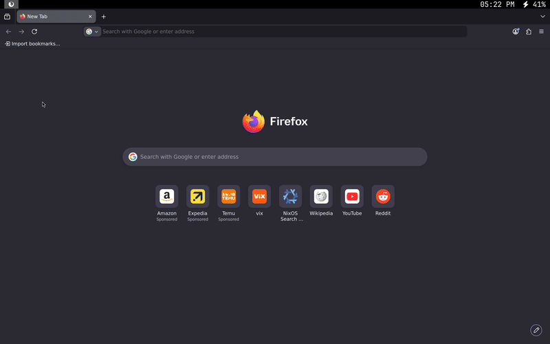

# Monowm 🙉

Lightweight window manger for x that can run with under 3mb of ram. This window manager follows the mobile workflow where one app/window always occupies the entire screen.



## How to install

### Dependencies

#### Build Dependencies
Install the required tools and X11 development headers for your distribution:

**Arch-based:**
```bash
sudo pacman -S base-devel libx11 libxcomposite libxrender libxft pkgconf
```

**Debian/Ubuntu-based:**
```bash
sudo apt update && sudo apt install build-essential libx11-dev libxcomposite-dev libxrender-dev libxft-dev pkg-config
```

**Fedora-based:**
```bash
sudo dnf groupinstall "Development Tools" && sudo dnf install libX11-devel libXcomposite-devel libXrender-devel libXft-devel pkgconf-pkg-config
```

**NixOS:**
You can use the provided [shell.nix](shell.nix) to enter a development shell with all build dependencies:
```bash
nix-shell
```

#### Xorg Server (Required Runtime)
Since `monowm` is an X11 window manager, you will need the Xorg server and `xinit` (for `startx`) installed:

**Arch-based:**
```bash
sudo pacman -S xorg-server xorg-xinit
```

**Debian/Ubuntu-based:**
```bash
sudo apt update && sudo apt install xserver-xorg xinit
```

**Fedora-based:**
```bash
sudo dnf install xorg-x11-server-Xorg xinit
```

**NixOS:**
Enable the X11 windowing system in your `/etc/nixos/configuration.nix`:
```nix
services.xserver.enable = true;
```

#### Optional Runtime Dependencies
These are recommended for the default configuration:
* [alacritty](https://github.com/alacritty/alacritty) (default terminal)
* [dmenu](https://tools.suckless.org/dmenu/) (to launch applications)
* [pipewire](https://pipewire.org/) (for volume control)
* [brightnessctl](https://github.com/Hummer12007/brightnessctl) (to control screen brightness)
* [dunst](https://github.com/dunst-project/dunst) (to see volume changes and low battery notifications)
* [xwallpaper](https://github.com/stoeckmann/xwallpaper) (For Background)
* xcompmgr or any x compositor
* A Nerd Font of your choice (for the bar icons)

### Installation Steps

1. Clone the repository:
   ```bash
   git clone https://github.com/dantevazquez/monowm.git
   cd monowm
   ```
2. Build and install:
   ```bash
   make install
   # Or on NixOS: nix-shell --run "make install"
   ```
3. Run `startx` or launch from your favorite display manager.

#### Optional builds

If you're running this on a 1967 thinkpad, you can compile without the bar, tab switcher or both.
```bash
./configure --nobar --noswitcher
make
make install
```
or
```bash
make NOBAR=1 NOSWITCHER=1 install
```

### Nix flake / NixOS

Build Monowm directly from GitHub:

```bash
nix build github:dantevazquez/monowm
```

To use the included NixOS module, add Monowm to the `inputs` of your system
flake:

```nix
inputs.monowm = {
  url = "github:dantevazquez/monowm";
  inputs.nixpkgs.follows = "nixpkgs";
};
```

Then import the module in your `nixosSystem`:

```nix
modules = [
  ./configuration.nix
  inputs.monowm.nixosModules.default
];
```

Enable the X server and Monowm in `configuration.nix`:

```nix
{
  services.xserver.enable = true;
  services.xserver.windowManager.monowm.enable = true;

  # Optional compile-time features (both default to true).
  services.xserver.windowManager.monowm.withBar = false;
  services.xserver.windowManager.monowm.withSwitcher = false;

  # Optional: start Monowm automatically instead of choosing it at login.
  services.displayManager.defaultSession = "none+monowm";

  #Optional: Don't insall with recommend packages like alacritty, dmenu, xcompmgr, etc.
  services.xserver.windowManager.monowm.recommendedPackages = false
}
```

## Configuration
* Core configurations (bindings, custom hotkeys, auto-run commands) can be configured in `~/.config/monowm/config.conf` (see template: [config.conf](templates/config.conf)). You can also find the default binds here. Internal bindings only exist when their setting is present in the config; removing one disables it.
* Additional startup configuration and display setttings can be customized in `~/.config/monowm/autostart` (see default: [autostart](autostart)).
* Bar configuration can be configured in `~/.config/monowm/bar.conf` (see template: [bar.conf](templates/bar.conf)).
* Window switcher font, font size, and colors can be configured in `~/.config/monowm/switcher.conf` (see template: [switcher.conf](templates/switcher.conf)).

Changes take effect after `monowm --reload` or with ctrl f4.

## Coming soon...
* Bug fixes

## Documentation

The [documentation](https://monos.dantevazquez.com/) of monos can give you more information on how to use monowm.
